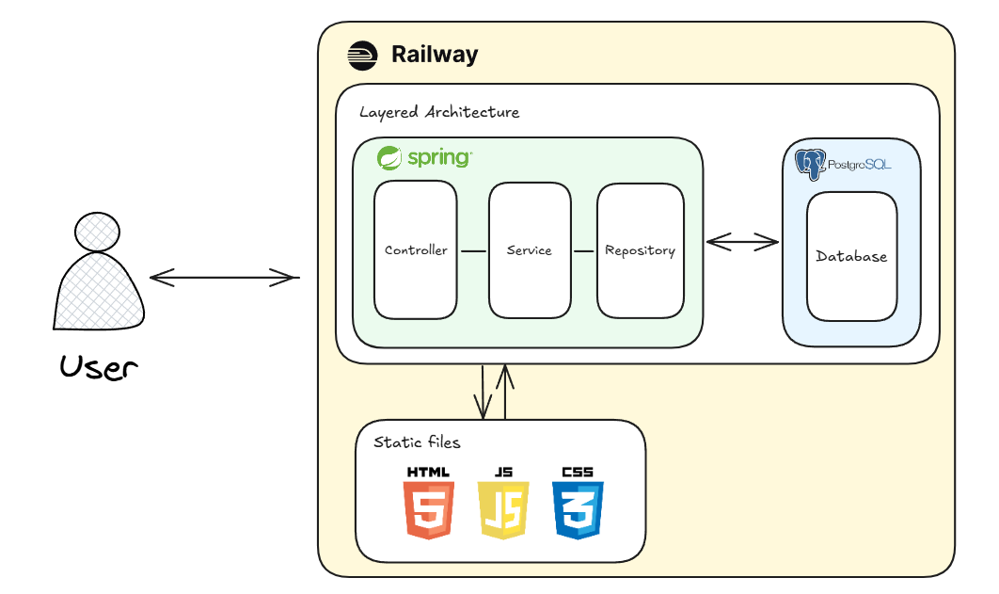

# Findex

## 💫 팀원 소개
| 김이준 | 문은서 | 신은수 | 김찬호 | 신동진 |
| :---: | :---: | :---: | :---: | :---: |
|  |  |  |  |  |

## 📌프로젝트 소개
한눈에 보는 금융 지수 데이터 대시보드 서비스

프로젝트 기간: 2025. 07.28. ~ 2025. 08.06.

## 프로젝트 다이어그램

# 🤖기술 스택
## 백엔드 & 데이터베이스

- `Spring Data JPA`, `springdoc-openapi`, `mapstruct` 사용

## 테스팅 툴

## 배포

## 협업 툴

# 💡팀원별 구현 기능 상세
## 문은서 - 지수 정보 관리
### 지수 정보 등록
- 지수 분류명, 지수명, 채용 종목 수, 기준 시점, 기준 지수, 즐겨찾기를 통해 지수 정보를 등록하는 기능 구현
- 채용 종목 수, 기준 시점, 기준 지수, 즐겨찾기를 통해 지수 정보를 등록하는 기능 구현

### 지수 정보 수정
- 채용 종목 수, 기준 시점, 기준 지수, 즐겨찾기을 수정할 수 있는 기능 구현
- 채용 종목 수, 기준 시, 기준 지수는 Open API를 활용해 자동으로 수정할 수 있게끔 구현

### 지수 정보 삭제
- 지수 정보를 삭제하면 관련된 지수 데이터도 같이 삭제되는 기능 구현

### 지수 정보 목록 조회
- 지수 분류명, 지수명, 즐겨찾기로 지수 정보 목록을 조회할 수 있는 기능 구현.
  - 조회 조건이 여러 개인 경우 모든 조건을 만족한 결과로 조회

- 지수 분류명, 지수명, 채용 종목 수로 정렬 및 페이지네이션을 구현.
  - nextIdAfter, nextCursor를 활용하여 페이지네이션 구현

## 신동진 - 지수 데이터 관리
- 지수 정보의 외래키와 기준일자를 바탕으로 지수 데이터를 등록할 수 있는 기능
  - 지수 정보, 기준일자는 중복되면 안되게끔 구현
- 지수 정보, 기준일자를 제외한 모든 속성을 수정할 수 있는 기능
- 지수 데이터를 선택하여 삭제할 수 있는 기능
- 지수 정보, 기준일자를 바탕으로 지수 데이터 목록을 조회할 수 있는 기능
- 소스 타입을 제외한 모든 속성으로 정렬 및 페이지네이션 구현
- 생성한 지수 데이터들을 CSV파일로 Export(다운로드) 할 수 있는 기능 구현
## 김찬호 - 연동 작업 관리
### 지수 정보 연동
- Open API를 활용해 지수 정보를 등록, 수정
- 지수 정보 연동은 사용자가 직접 실행 가능

### 지수 데이터 연동
- Open API를 활용해 지수 데이터를 등록, 수정
- 지수, 대상 날짜로 연동할 데이터의 범위를 지정

### 연동 작업 목록 조회
- 유형, 지수, 대상 날짜, 작업자, 결과, 작업일시로 연동 작업 목록을 조회할 수 있는 기능 구현
- 대상 날짜, 작업일시으로 정렬 및 페이지네이션을 구현

## 신은수 - 자동 연동 설정 관리
(추가)

## 김이준 - 대시보드 관리

### 주요 지수 현황 요약
- 즐겨찾기된 지수의 성과 정보를 포함하도록 기능 구현 
  - 성과는 종가를 기준으로 비교하는 로직 구현 
  - 성능 향상을 위해 @Query를 사용해서 적절한 SQL문 작성
### 지수 차트
- 월/분기/년 단위 시계열 데이터 사용 
- 이동평균선 데이터 로직 구현 
- 종가를 기준으로 전 5일/20일 데이터의 평균값을 내는 로직 구현
### 지수 성과 분석 랭킹
- 전일/전주/전월 대비 성과 랭킹 기능 구현 
- 성과는 종가를 기준으로 비교하는 로직 구현 
- 성능 향상을 위해 @Query를 사용해서 적절한 SQL문 작성

# 📋 파일 구조
(팀 논의 후 추가)

# 🚀구현 홈페이지
(링크, 스크린샷 추가)
프로젝트 회고록

